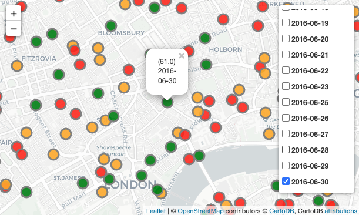

# Predictions on bike sharing demand
<p align="center"> 
  
</p>

## :bulb: Purpose


The motivation is to make a predictions where the current existing app such as CityMapper or Google map currently do not support. Providing predictive figure, which we are aiming in the project, would result reduce of making such error where the current 
application are limited. 

Objective for this project is to build multiple machine learning models to predict and analysis the bike sharing demand in London. Data modification, machine learning model construction, visualisation of data are main objectives in this project, and further analysis on each
of the performance of the model will be carried forward.


## :woman_technologist:	Technologies Used

- **Keras** Used for neural network API, set up foundation for building machine learning models
- **Tensorflow** Deep learning framework for developing machine learning models at scale
- **Pandas** A library for data analysis and manipulation, essential for preparing and handling data efficiently.
- **Python:** The primary programming language used to implement the project.
- **Jupyter Notbook** An interactive environment used for data visualization, exploration, and rapid prototyping.


## ✔️ Getting Started

### Source of Data Set

* TFL data set link: https://cycling.data.tfl.gov.uk/

The data in period of 1st of April in 2016 to 1st of November in 2016 is used in this project.
It is recommanded to download _2016TripDataZip.zip_ file first and download rest of the _.csv_ file from _04JourneyDataExtract01Apr2016-30Apr2016.csv_ to _29JourneyDataExtract26Oct2016-01Nov2016.csv_

* UCL data set link: https://archive.ics.uci.edu/ml/datasets/bike+sharing+dataset

* Docking station data set link: https://www.whatdotheyknow.com/request/request_for_location_of_santande#incoming-1572474

### Merged Data Set

* April_1_months.csv
* April_to_June_3_months.csv
* April_to_Oct_6_months.csv


Having these following _.csv_ files must be located in the same directory as the python script, in this case _.ipynb_ file. For example, if one of the jupyter notebook file was in the Desktop, all of the _.csv_ files need to be saved in Desktop.

### Package
* Jupyter notbook is used in this project, these are required to be installed with following code below. 
* If need help, further support can be made in https://jupyter.org/install

```
pip install notebook
```

* Tensorflow and kera package is used in this project, these are required to be installed with following code below.
* If need help, further support can be made in https://www.tensorflow.org/hub/installation.

TensorFlow and Keras require Python 3.6+ (Python 3.8 requires TensorFlow 2.2+), and the latest version of pip. 
Run following command below to check the current version for python:

```
python3 --version
```
```
pip install --upgrade pip
```
To install TensorFlow for CPU and GPU processors, run the following command:
```
pip install tensorflow
```

### Executing program

Run following command to activate jupyter notebook:
```
jupyter notebook
```

This will provide jupyter enviornment, executing the code will be available after finding the correct directory where all the _.csv_ and _.ipynb_ files are.


<!-- CREDITS -->
<h2 id="credits"> :scroll: Credits</h2>

Hana Chae!

[](https://github.com/hchae0817)
[](https://www.linkedin.com/in/hana-chae-06a9001b8/)
